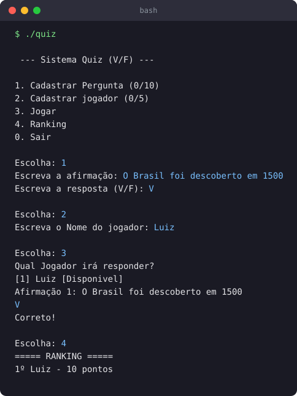

# Quiz de Verdadeiro ou Falso (C)

Um jogo de quiz simples pra terminal, feito estudando C. Dá pra
cadastrar perguntas, cadastrar jogadores e ver um ranking no final.

## O que ele faz

- Cadastro de até 10 afirmações com resposta V ou F
- Cadastro de até 5 jogadores
- Cada jogador responde as perguntas e ganha 10 pontos por acerto
- Ranking ordenado por pontuação

## O que pratiquei aqui

- `struct` para perguntas e jogadores
- Separação do código em funções
- Leitura de texto com `fgets` e limpeza do `\n`
- Ordenação com bubble sort para o ranking
- Controle de estado (jogador disponível / já jogou)

## Demonstração



## Como compilar e rodar

```bash
gcc main.c -o quiz
./quiz
```

Feito no Code::Blocks. Usa `setlocale` para acentos no Windows.
