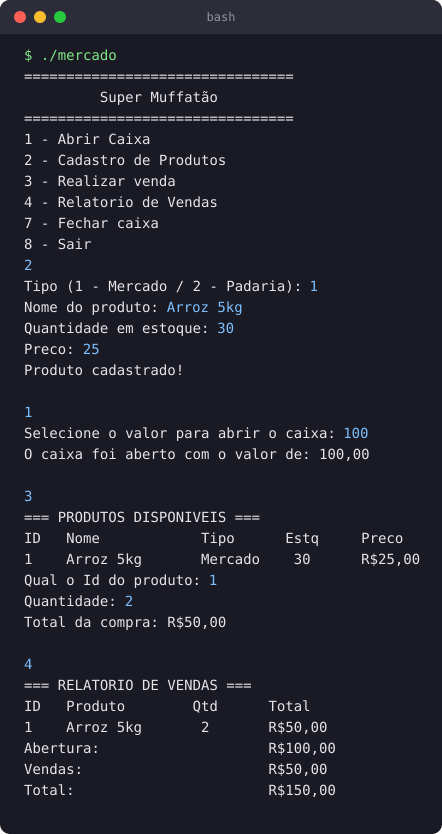

# Sistema de Mercado (C)

Um dos projetos que fiz estudando C na faculdade. Comecei com uma
simulação de caixa bem simples e fui adicionando coisas conforme
aprendia — foi onde ponteiros e alocação dinâmica finalmente
fizeram sentido pra mim.

## O que ele faz

- Cadastro e edição de produtos (mercado / padaria)
- Controle de estoque
- Registro de vendas com cálculo de total
- Relatório de vendas e lista dos produtos mais vendidos
- Abertura e fechamento de caixa, salvando o histórico em arquivo `.txt`

Ao abrir o programa ele recarrega os produtos do arquivo, então os
dados não se perdem entre uma execução e outra.

## O que pratiquei aqui

- `struct` e vetor de structs
- Alocação dinâmica: `malloc`, `realloc`, `free`
- Ponteiros e passagem por referência entre funções
- Leitura e escrita de arquivos (`fopen`, `fgets`, `fprintf`, `sscanf`)

## Demonstração



## Como compilar e rodar

```bash
gcc main.c -o mercado
./mercado
```

Feito no Code::Blocks (Windows). Usa `system("cls")` e `system("pause")`,
então roda melhor no terminal do Windows.
